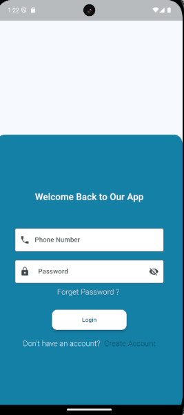
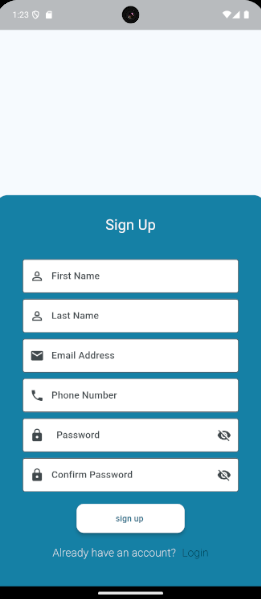
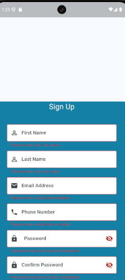

# First App 🚀

A Flutter mobile application built with clean architecture principles. This project includes a splash screen, sign up, login, OTP verification, and a home screen with basic UI components.

---

## 🧠 Main Features

- Splash Screen
- Sign Up & Login Forms
- OTP Verification
- Home Screen with Navigation
- Password visibility toggle
- Clean and reusable UI components

---

## 🧰 Technologies Used

- **Flutter** 🐦
- **Dart**
- **Material Design**
- **StatefulWidgets & StatelessWidgets**
- **Navigator (push & pushReplacement)**
- **Form Validation**
- **GestureDetector**
- **MediaQuery** for responsive layout

---

## ✨ Screenshots

## 🧱 Architecture

The app is built using a **Clean Code Architecture**, which includes:

- Reusable Widgets and Screens
- Separate files for strings, constants, and logic
- Avoiding code duplication

---
